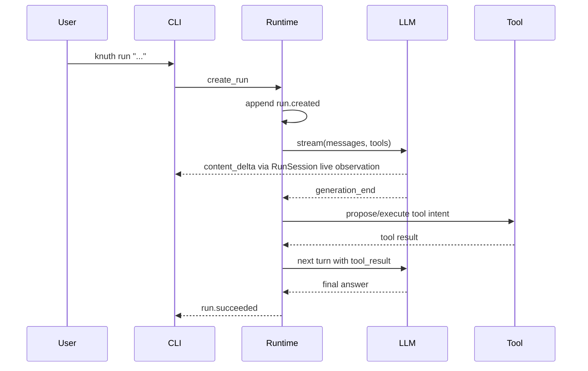
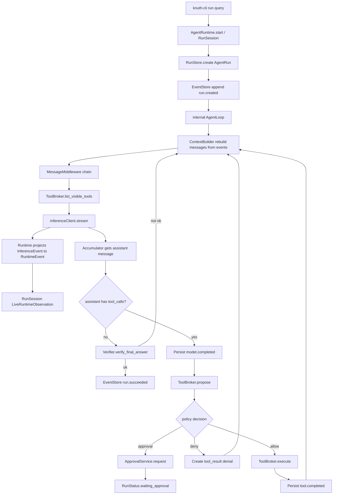

> **⚠️ SUPERSEDED**：本文档已被 [knuth-v0-design.md](knuth-v0-design.md) 取代（2026-06-10）。
> 主要修订：持久化改为"事件为唯一权威 + 同步派生投影 + 校验聚合"（RunLedger 模型）、
> approval/恢复链路闭合、外部写崩溃语义（UNKNOWN + idempotency）、hook 收权（无 MUTATE）、
> 安全红线前置。本文仅作历史参考，其中 hook 系统（§12）、事件三字段（§10）、
> ToolBase(BaseModel)（§6）等设计已作废。

下面是我建议的 **knuth v0 核心方案**。重点不是一次性实现所有高级能力，而是先把边界定对：`LLM 只负责推理和提出意图`，`runtime 负责状态和流程`，`toold 负责工具发现与执行`，`event system 负责可观察和可暂停`。这样 v0 很小，但不会把未来的 daemon、approval、rollback、cache、workflow、plugin 都堵死。


------

## 1. v0 的组件边界

Python 发行包可以用连字符命名，例如 `knuth-runtime`，但 Python import package 建议统一放在 `knuth.*` namespace 下。

建议目录：

```text
knuth/
  core/
    ids.py
    types.py
    messages.py
    events.py
    errors.py
    schemas.py

  llmd/
    client.py
    litellm_client.py
    event_accumulator.py

  toold/
    base.py
    registry.py
    broker.py
    providers.py
    builtin/
      read_file.py
      write_file.py
      shell.py

  runtime/
    run.py
    loop.py
    context.py
    middleware.py
    hooks.py
    event_store.py
    artifact_store.py
    approval.py
    policy.py
    services.py

  cli/
    main.py
```

组件职责如下：

```text
knuth-cli
  - 验证流程
  - 创建 run
  - 展示流式输出、timeline、approval
  - 执行 resume / approve / cancel / tools list

knuth-runtime
  - AgentRun 生命周期
  - Agent loop
  - Context 构建与消息中间件
  - EventStore / ArtifactStore / ApprovalService
  - Hook/Event system
  - Policy decision
  - 不直接执行工具

knuth-llmd
  - InferenceClient 抽象
  - LiteLLM provider adapter
  - stream / complete
  - 把 provider 的 streaming chunks 归一化成 InferenceEvent
  - 不知道工具怎么执行

knuth-toold
  - ToolBase / ToolProvider / ToolRegistry
  - ToolBroker.propose / execute
  - 参数校验、并行策略、结果归一化
  - 后续接 Python plugin、subprocess worker、MCP provider

knuth-core
  - 所有组件共享的数据结构
  - Message、ToolIntent、ToolResult、RuntimeEvent、RunStatus 等
```

v0 可以全部 in-process 跑，`knuth-cli` 直接 import runtime、llmd、toold。不要一开始就拆真正的 daemon。包边界先拆好，进程边界以后再加。

```mermaid

```

LiteLLM 适合作为 v0 provider adapter，因为它官方提供异步 completion、streaming completion，并以 OpenAI-like 格式统一多家模型接口；function calling 和 parallel function calling 也可以通过它接入。v0 不要把 runtime 绑定死在 LiteLLM 上，而是只让 `LiteLLMInferenceClient` 实现 `InferenceClient`。([LiteLLM](https://docs.litellm.ai/docs/completion/stream?utm_source=chatgpt.com))

------

## 2. 两套事件：InferenceEvent 与 RuntimeEvent

这里要先分清楚。

`InferenceEvent` 是 **LLM 和 runtime 之间的底层 transient stream 协议**，用于 runtime 解析本轮模型输出。它不是 UI 事件，也不是 durable event。

`RuntimeEvent` 是 **runtime-level event language**，用于 run timeline、恢复、审计、hook、debug，以及对 active observer 的 live observation。它覆盖模型流的语义投影，但不一比一持久化所有 transient deltas。

不要把每个 `inference.content.delta` 都永久写进 EventStore，否则很快膨胀。v0 把底层 `InferenceEvent` 投影成 transient `RuntimeEvent` 发给当前 `RunSession` 的 `LiveRuntimeObservation`；EventStore 只持久化 `model.started`、`model.completed`、`tool.started`、`tool.completed`、`approval.requested`、`run.succeeded` 这类 coarse event。

```mermaid

```

------

## 3. knuth-core：基础类型

建议所有 Pydantic model 都带 `schema_version` 和 `metadata`，并保留向前兼容的扩展空间。具体用哪种 Pydantic 配置方式属于实现细节，方案只约束事件 payload、工具 metadata 这类结构需要可演进。

```python
# knuth/core/types.py
class KnuthModel:
    schema_version: str
    metadata: dict


class RunStatus:
    CREATED
    RUNNING
    WAITING_APPROVAL
    PAUSED
    FAILED
    SUCCEEDED
    CANCELLED


class EventDurability:
    TRANSIENT
    DURABLE


class ErrorInfo(KnuthModel):
    code: str
    message: str
    retryable: bool
    details: dict
```

------

## 4. InferenceMessage 设计

你现在的 `InferenceMessage` 有 `user/system/assistant/tool_result` 四类是对的，但还缺几个关键字段：

1. `tool_result` 必须能关联到原始 tool call；
2. `assistant` 必须能携带 tool calls；
3. content 后面可能不只是纯字符串；
4. metadata 要保留 provider/raw 信息。

LiteLLM 的输入参数文档里也有 `tool_call_id` 这类字段，用来表示某条 tool response 是对哪个 tool call 的响应。([LiteLLM](https://docs.litellm.ai/docs/completion/input?utm_source=chatgpt.com))

```python
# knuth/core/messages.py
class InferenceRole:
    SYSTEM
    USER
    ASSISTANT
    TOOL_RESULT


class ToolCall(KnuthModel):
    id: str
    name: str
    arguments: dict
    arguments_json: str | None = None
    index: int
    raw: dict


class InferenceMessage(KnuthModel):
    role: InferenceRole
    content: str | None
    tool_calls: list[ToolCall]
    tool_call_id: str | None = None
    tool_name: str | None = None
    name: str | None = None
    metadata: dict

    # provider-specific conversion belongs in llmd, not runtime.
    def to_litellm_message(self) -> dict: ...
```

------

## 5. knuth-llmd：InferenceClient

建议把 `InferenceClient` 定义成 abstract interface，不要直接写死 LiteLLM。

`complete` 是非流式，适合 summarization、classification、verification 这类无工具调用的小任务。

`stream` 是 agent loop 主路径，返回 `AsyncIterator[InferenceEvent]`。

注意：`InferenceConfig` 应该保持可序列化。`anyio.CancelScope` 这种运行时对象不要塞进 Pydantic model。AnyIO 的 cancellation 是基于 cancel scope 的结构化取消模型，适合作为 runtime options，而不是持久化配置。([AnyIO](https://anyio.readthedocs.io/en/stable/cancellation.html?utm_source=chatgpt.com))

```python
# knuth/llmd/client.py
class UsageInfo(KnuthModel):
    input_tokens: int | None = None
    output_tokens: int | None = None
    total_tokens: int | None = None
    cost_usd: float | None = None


class InferenceConfig(KnuthModel):
    temperature: float | None
    max_output_tokens: int | None
    timeout_s: float | None
    trace_id: str | None = None
    run_id: str | None = None
    provider_options: dict


class AbortSignal(Protocol):
    def is_aborted(self) -> bool: ...
    async def checkpoint(self) -> None: ...


class InferenceRuntimeOptions(KnuthModel):
    abort_signal: AbortSignal | None


class InferenceResult(KnuthModel):
    message: InferenceMessage
    finish_reason: str | None
    usage: UsageInfo | None
    raw: dict


class InferenceClient(Protocol):
    @property
    def model(self) -> str:
        ...

    async def stream(
        self,
        messages: list[InferenceMessage],
        tools: list[dict[str, Any]],
        config: InferenceConfig,
        runtime: InferenceRuntimeOptions | None = None,
    ) -> AsyncIterator[InferenceEvent]:
        ...

    async def complete(
        self,
        messages: list[InferenceMessage],
        config: InferenceConfig,
        runtime: InferenceRuntimeOptions | None = None,
    ) -> InferenceResult:
        ...
```

### LiteLLMInferenceClient 的职责

`LiteLLMInferenceClient` 要做三件事：

1. 把 `InferenceMessage` 转成 LiteLLM/OpenAI-like messages；
2. 把 `ToolSpec` 转成 function tool spec；
3. 把 provider streaming chunk 归一化成 `InferenceEvent`。

流式 tool call 的半截 arguments 可以作为 `inference.tool_call.delta` 被观察和累计，但不能转换成可执行 `ToolIntent`。只有 `inference.tool_call.completed` 携带完整 `ToolCall`，runtime 才能把它转换成 `ToolIntent`。

```mermaid

```

Adapter 骨架：

```python
# knuth/llmd/litellm_client.py
class LiteLLMInferenceClient(InferenceClient):
    async def stream(...) -> AsyncIterator[InferenceEvent]: ...
    async def complete(...) -> InferenceResult: ...


class StreamAccumulator:
    def feed_chunk(...) -> list[InferenceEvent]: ...
    def finish(...) -> list[InferenceEvent]: ...
    def to_message(...) -> InferenceMessage: ...
```

------

## 6. ToolSpec、ToolBase、ToolManifest 要拆开

你现在的 `ToolBase` 把三件事混在一起了：

1. 给 LLM 看的 function spec；
2. runtime 用的风险、并行、缓存 metadata；
3. 真正的执行代码。

v0 建议拆成：

```text
ToolManifest
  - runtime metadata
  - name, description, parameters, risk, cacheable, parallelable

ToolSpec
  - 发给模型的 function schema
  - 从 ToolManifest 裁剪出来

ToolBase
  - Python 内置工具实现
  - async __call__(ctx, **kwargs) -> ToolResult

ToolProvider
  - 一组工具的来源
  - 可以是 built-in、entry point、subprocess、MCP
```

骨架：

```python
class ToolRisk: ...
class ToolEffect: ...


class ToolManifest:
    name: str
    description: str
    parameters: dict
    parallelable: bool
    cacheable: bool
    risk: ToolRisk
    effect: ToolEffect
    provider: str


class ToolContext:
    run_id: str
    tool_call_id: str
    workspace_uri: str | None


class ToolResult:
    status: ToolResultStatus
    content: str | None
    data: object
    error: ErrorInfo | None
    artifacts: list[str]


class ToolBase:
    def manifest(...) -> ToolManifest: ...
    async def __call__(...) -> ToolResult: ...
```

你原来的 `cachable` 建议改成 `cacheable`。如果担心兼容，可以在模型里做 alias。

------

## 7. ToolProvider：解决“像 TS 一样运行时注入三方功能”

在 Python 里，不建议一上来让第三方直接把任意 function 注入主进程。更好的 v0 设计是 `ToolProvider`。

```python
# knuth/toold/providers.py
class ToolProvider:
    name: str

    async def list_tools(...) -> list[ToolManifest]: ...
    async def call_tool(...) -> ToolResult: ...
```

然后做四种 provider：

```text
BuiltinToolProvider
  - 直接注册 Python ToolBase
  - v0 主力

EntryPointToolProvider
  - 通过 Python package entry points 发现第三方工具
  - 适合 pip install knuth-tool-xxx 后自动发现

SubprocessToolProvider
  - 第三方工具跑在子进程
  - 更安全，适合非信任工具

McpToolProvider
  - 后续接 MCP server
  - 工具列表可动态变化
```

Python packaging 的 entry points 本来就是让安装包向宿主程序暴露可发现组件的机制，很适合 `pip install knuth-tool-foo` 后被 `ToolRegistry` 自动发现。([Python Packaging](https://packaging.python.org/specifications/entry-points/?utm_source=chatgpt.com))

entry point 骨架：

```toml

```

加载：

```python
# knuth/toold/registry.py
class BuiltinToolProvider(ToolProvider):
    def register(tool: ToolBase) -> None: ...
    async def list_tools() -> list[ToolManifest]: ...
    async def call_tool(name: str, args: dict, ctx: ToolContext) -> ToolResult: ...


class ToolRegistry:
    def add_provider(provider: ToolProvider) -> None: ...
    async def refresh() -> None: ...
    async def discover_entry_points(group: str = "knuth.tools") -> None: ...
    def get_manifest(name: str) -> ToolManifest: ...
    def get_provider_for_tool(name: str) -> ToolProvider: ...
    def list_visible_manifests() -> list[ToolManifest]: ...
```

后续如果接 MCP，可以让 `McpToolProvider` 监听工具列表变化。MCP tools spec 里有 `listChanged` 能力，server 可以声明工具列表变化时发 `notifications/tools/list_changed` 通知，这正好对应 `ToolRegistry.refresh()`。([Model Context Protocol](https://modelcontextprotocol.io/specification/2025-03-26/server/tools?utm_source=chatgpt.com))

------

## 8. ToolIntent、ToolProposal、ToolBroker

LLM 产出的不是 ToolResult，而是 ToolIntent。

```python
# knuth/toold/broker.py
class ToolProposalStatus:
    ALLOWED
    REQUIRES_APPROVAL
    DENIED


class ToolIntent(KnuthModel):
    id: str
    name: str
    arguments: dict
    index: int
    raw: dict


class ApprovalRequest(KnuthModel):
    id: str
    run_id: str
    title: str
    reason: str
    risk: str
    payload: dict
    metadata: dict


class ToolProposal(KnuthModel):
    status: ToolProposalStatus
    intent: ToolIntent
    normalized_args: dict
    approval: ApprovalRequest | None
    error: ErrorInfo | None


class ToolExecutionRecord(KnuthModel):
    intent: ToolIntent
    result: ToolResult
    def to_tool_result_message(...) -> InferenceMessage: ...
```

`ToolBroker` 做这些事：

1. 工具是否存在；
2. 参数校验；
3. policy 判断；
4. approval 判断；
5. 执行；
6. 并行或串行；
7. 结果转成 tool_result message。

```python
class ToolBroker:
    async def list_visible_tools(run_id: str) -> list[dict]: ...
    async def propose(run_id: str, intent: ToolIntent) -> ToolProposal: ...
    async def execute(run_id: str, proposal: ToolProposal) -> ToolExecutionRecord: ...
```

### 多工具调用与并行

v0 不要让 agent loop 一个个乱处理 tool call delta。建议本轮模型输出结束后，拿到完整 `tool_calls`，形成 `ToolBatchIntent`。

```python
class ToolBatchIntent(KnuthModel):
    run_id: str
    assistant_message_id: str
    intents: list[ToolIntent]
```

执行策略：

```text
如果 tool_calls 为空：
  content 是 final answer candidate

如果 tool_calls 非空：
  先持久化 assistant message with tool_calls
  再逐个 propose

如果任意 proposal requires_approval：
  创建 approval
  run.status = waiting_approval
  结束本次 invocation

如果全部 allowed：
  如果所有 tool manifest.parallelable=True：
      并行执行，但按原 index 顺序返回 tool_result messages
  否则：
      串行执行
```

并行不要太早激进。v0 可以先串行，保留 `parallelable` 字段。真正并行时，推荐用 AnyIO task group，因为后续 cancellation、timeout、structured concurrency 会更清楚。

------

## 9. PolicyEngine 与 ApprovalService

v0 的 policy 不要复杂，但接口要有。

```python
# knuth/runtime/policy.py
class PolicyDecisionKind:
    ALLOW
    DENY
    APPROVAL


class PolicyDecision(KnuthModel):
    kind: PolicyDecisionKind
    approval: ApprovalRequest | None
    error: ErrorInfo | None


class PolicyEngine:
    async def evaluate_tool_call(
        run_id: str, manifest: ToolManifest, args: dict
    ) -> PolicyDecision: ...
```

ApprovalService：

```python
# knuth/runtime/approval.py
class ApprovalStatus:
    PENDING
    APPROVED
    DENIED
    EXPIRED


class Approval(KnuthModel):
    id: str
    run_id: str
    status: ApprovalStatus
    title: str
    reason: str
    risk: str
    payload: dict
    created_at: str
    resolved_at: str | None
    metadata: dict


class ApprovalService:
    async def request(approval: Approval) -> Approval: ...
    async def resolve(approval_id: str, status: ApprovalStatus) -> Approval: ...
    async def list_pending(run_id: str | None = None) -> list[Approval]: ...
```

------

## 10. AgentRun 与 EventStore

`AgentRun` 保存一次用户请求的总状态。不要把所有 messages 都塞进 `AgentRun` 字段里；messages 应该从 EventStore 重建，或者通过 projection 缓存。

```python
# knuth/runtime/run.py
class AgentRun(KnuthModel):
    id: str
    user_id: str | None
    query: str
    status: RunStatus
    created_at: str
    updated_at: str
    parent_run_id: str | None
    title: str | None
    max_turns: int
    budget: dict
    metadata: dict
```

RuntimeEvent：

```python
# knuth/core/events.py
class RuntimeEvent(KnuthModel):
    id: str
    run_id: str
    seq: int
    type: str
    durability: EventDurability
    created_at: str

    # 具体字段由强类型事件 class 表达，例如：
    # model.completed: turn, message, finish_reason, usage
    # tool.completed: intent, message, outcome, result
```

EventStore：

```python
# knuth/runtime/event_store.py
class EventStore(Protocol):
    async def append(
        run_id: str, event: DurableRuntimeEventDraft
    ) -> RuntimeEvent:
        ...

    async def list_events(
        self,
        run_id: str,
        after_seq: int | None = None,
    ) -> list[RuntimeEvent]:
        ...
```

v0 可以有两个实现：

```text
MemoryEventStore
  - 单测和快速 demo

SQLiteEventStore
  - knuth-cli 默认
  - ~/.knuth/knuth.db
```

SQLite 存储只需要表达这些实体和关系，不在方案里约束具体 DDL：

```text
runs
events
approvals
artifacts
```

------

## 11. 消息中间件：Context 与 ContextBuilder

你提到 `class Conetxt`，建议拼成 `Context`，但更准确地说有两个概念：

```text
RunContext
  - 当前 run 的服务、配置、状态

ContextView
  - 即将发给 LLM 的 messages + tools
  - 会被 middleware 修改
# knuth/runtime/context.py
class RunContext(KnuthModel):
    run_id: str
    user_id: str | None
    workspace_uri: str | None
    metadata: dict


class ContextView(KnuthModel):
    run_id: str
    messages: list[InferenceMessage]
    tools: list[dict]
    diagnostics: dict
    metadata: dict
```

Middleware 接口：

```python
# knuth/runtime/middleware.py
class MessageMiddleware(ABC):
    name: str
    priority: int = 100

    async def process(
        self,
        ctx: RunContext,
        view: ContextView,
    ) -> ContextView:
        ...
```

System section provider 接口：

```python
class SystemSectionProvider(ABC):
    async def sections(self, ctx: RunContext) -> list[SystemSection]:
        ...
```

v0 可以内置几个 middleware：

```text
ToolFilterMiddleware
  - 根据 policy/project 过滤工具

HistoryCompactionMiddleware
  - 简单压缩历史，只保留最近 N 轮
  - v0 可以先不做复杂 summarization

SensitiveContentFilterMiddleware
  - 过滤不该送进模型的 metadata/secrets

BudgetMiddleware
  - 控制最大消息数或近似 token
```

系统提示不要做成 `SystemPromptMiddleware`。当前边界是 `SystemPreamble + SystemSection + SystemSectionProvider`：provider 只贡献 preamble section，`ContextBuilder.build` 每轮重新装配一条 leading system message，并且不把 preamble 写入 EventStore。`MessageMiddleware` 仍然保留为改写整个 `ContextView` 的重型 seam。

ContextBuilder 负责从 EventStore 重建消息：

```python
class ContextBuilder:
    async def build(ctx: RunContext) -> ContextView: ...
```

消息重建规则：

```text
run.created / user.message
  -> user message

model.completed
  -> assistant message
  -> 如果有 tool_calls，要保留在 assistant message 上

tool.completed
  -> tool_result message

system.note
  -> system 或 assistant metadata，视具体用途
```

------

## 12. Hook/Event system

这里要把 observation 和 control 拆开：

```text
RuntimeEventListener
  - 只观察 RuntimeEvent
  - 声明 RuntimeEventInterest
  - 用于 CLI 渲染、日志、debug、metrics、TUI、WebSocket fan-out
  - 不通过返回值暂停、终止、审批、拒绝或改变 run 状态

BlockingHook
  - 在少数 HookPoint 上由 runtime await
  - 只能返回 continue / pause / terminate
  - 不改写 context、messages、tools、tool intent、proposal 或 inference config
```

live observation 由 `RunSession` 创建 invocation-scoped hub，每个 listener 一条 bounded AnyIO memory object stream。`RuntimeEventInterest` 可以按 exact dotted type、type prefix、durability 过滤，但这只是 observation-layer convenience，不把 `namespace/name` 加回 `RuntimeEvent`。

```python
class RuntimeEventListener(Protocol):
    @property
    def interest(self) -> RuntimeEventInterest:
        ...

    async def handle_event(self, event: RuntimeEvent) -> None:
        ...


class HookAction(StrEnum):
    CONTINUE = "continue"
    PAUSE = "pause"
    TERMINATE = "terminate"


class BlockingHook(Protocol):
    async def __call__(self, ctx: HookContext) -> HookResult:
        ...
```

建议 v0 第一版 hook point 保持很窄，只放在状态边界或外部副作用前，不铺满所有内部步骤：

```text
run.before_turn
tool.before_propose
tool.before_execute
approval.before_request
```

流程图：

```mermaid

```

------

## 13. Agent loop v0

核心原则：agent loop 不直接执行工具。它只处理模型输出，形成 `ToolIntent`，交给 `ToolBroker`。

clarification / ask-user 类能力先不进入 v0。不要在 agent loop 里按工具名特判，也不要为 `ask_user` 预留 `waiting_user` 状态；这类工具以后单独设计。

内置工具：

```text
knuth.finish
  可选
  如果你想强制 final answer 结构化，可以做成 finish tool
  v0 也可以不用，模型不调用 tool 时就视为 final answer candidate
```

Agent loop 主流程：

```mermaid

```

核心代码骨架：

```python
# knuth/runtime/loop.py
async def run_agent_loop(
    invocation: RuntimeInvocation,
    inference_config: InferenceConfig,
    runtime_options: InferenceRuntimeOptions | None = None,
) -> RunStatus:
    ...
```

`handle_tool_calls`：

```python
async def handle_tool_calls(
    invocation: RuntimeInvocation,
    assistant_message: InferenceMessage,
) -> RunStatus | None:
    ...
```

------

## 14. RuntimeServices：依赖集中注入

不要让 `run_agent_loop` 传十几个参数。做一个 services container。

```python
# knuth/runtime/services.py
class RuntimeServices(KnuthModel):
    inference_client: InferenceClient
    tool_broker: ToolBroker
    run_store: RunStore
    event_store: EventStore
    artifact_store: ArtifactStore
    approvals: ApprovalService
    context_builder: ContextBuilder
    verifier: Verifier
```

------

## 15. LiveRuntimeObservation 与 EventStore 的关系

v0 的 live observation 由 `RunSession` 在一次 `RunInvocation` 内创建 observation hub，agent loop 通过 `RuntimeInvocation.emit(...)` 发出 typed `RuntimeEvent`：

```python
class RuntimeInvocation:
    run_id: str
    services: RuntimeServices
    observation: LiveRuntimeObservation

    async def emit(event: RuntimeEventDraft) -> RuntimeEvent: ...
```

CLI/WebSocket/TUI 都实现 `RuntimeEventListener`，按 `RuntimeEventInterest` 订阅自己关心的 runtime event：

```text
model.content.delta -> stdout
model.reasoning.delta -> 如果 debug 模式打开再显示
model.tool_call.started / model.tool_call.completed -> 显示工具调用进度
run.invocation.started / run.invocation.ended -> 显示一次 invocation 生命周期
```

EventStore 只保存最终形态：

```text
model.started
model.completed
tool.intent
tool.proposed
tool.started
tool.completed
approval.requested
run.succeeded
run.failed
```

------

## 16. ArtifactStore

v0 可以先做文件系统 artifact store。

```python
class Artifact(KnuthModel):
    id: str
    run_id: str
    kind: str
    title: str | None
    uri: str
    metadata: dict
    created_at: str


class ArtifactStore:
    async def put_text(...) -> Artifact: ...
    async def get_text(artifact_id: str) -> str: ...
```

目录：

```text
~/.knuth/
  knuth.db
  artifacts/
    run_xxx/
      artifact_001.md
      artifact_002.json
```

后面 AgentFS 可以直接挂这里：

```text/runs/<run_id>/events
/runs/<run_id>/artifacts
/artifacts/<artifact_id>
/approvals/pending
/tools
```

------

## 17. Verifier v0

v0 不要复杂。先定义接口：

```python
class VerificationResult(KnuthModel):
    ok: bool
    reason: str | None
    metadata: dict


class Verifier:
    async def verify_final_answer(
        run_id: str, message: InferenceMessage
    ) -> VerificationResult: ...
```

后面可以换成：

```text
NoopVerifier
LLMVerifier
CodeTaskVerifier
ArtifactVerifier
WorkflowVerifier
```

------

## 18. knuth-cli v0

CLI 的目标是验证流程，不是做完整产品 UI。

命令建议：

```text
knuth run "帮我读取 README 并总结"
knuth resume <run_id>
knuth approve <approval_id>
knuth deny <approval_id>
knuth events <run_id>
knuth status <run_id>
knuth tools list
knuth tools refresh
```

`run` 流程：



------

## 19. 一个最小内置工具骨架

```python
# knuth/toold/builtin/read_file.py
class ReadFileTool(ToolBase):
    name: str
    description: str
    parameters: dict
    parallelable: bool
    cacheable: bool
    risk: ToolRisk
    effect: ToolEffect

    async def __call__(...) -> ToolResult: ...
```

clarification / ask-user 工具不属于 v0 内置工具集合，后续单独设计。

------

## 20. v0 的完整运行链路



------

## 21. 你草稿里的几个冲突点与 v0 决策

第二，`complete` 不要带 tools。它用于 summarization、verification、classification 等无工具任务。主 agent loop 用 `stream`。

第三，`InferenceConfig` 不要承载 `anyio.CancelScope` 这类对象。配置是可序列化的；取消信号是 runtime option。

第四，`ToolBase` 可以保留 Pydantic，但不要只靠继承实现扩展。v0 内置工具可以继承 `ToolBase`，第三方工具通过 `ToolProvider` 接入。

第五，`parallelable/cacheable` 可以保留，但 v0 不做真正缓存和复杂并行。最多先实现“全部 parallelable 才可 batch 并行”，默认串行。

第六，clarification / ask-user 类能力延期设计，v0 不放内置控制工具。

第七，事件系统不要和模型流式事件混成一套。`InferenceEvent` 是模型输出流；`RuntimeEvent` 是持久化事实。

第八，runtime 里的 `Context` 不应该只是一串 messages。它应该是 `RunContext + ContextView + Middleware` 组合。

------

## 22. v0 最小实现顺序

我建议按这个顺序写：

```text
1. knuth-core
   - InferenceMessage
   - ToolCall
   - RuntimeEvent
   - AgentRun
   - ErrorInfo

2. knuth-llmd
   - InferenceClient abstract class
   - LiteLLMInferenceClient
   - StreamAccumulator

3. knuth-toold
   - ToolBase
   - ToolManifest
   - BuiltinToolProvider
   - ToolRegistry
   - ToolBroker
   - read_file 等基础内置工具

4. knuth-runtime
   - MemoryRunStore
   - MemoryEventStore
   - ContextBuilder
   - MessageMiddleware
   - RuntimeEventListener / BlockingHook boundary
   - PolicyEngine
   - ApprovalService
   - run_agent_loop

5. knuth-cli
   - run
   - events
   - tools list
   - approve / resume 可以先 stub

6. SQLite 持久化
   - EventStore
   - RunStore
   - ApprovalStore
   - ArtifactStore
```

v0 的第一个 demo 可以非常简单：

```text
用户：读取 README.md，然后总结

模型：调用 read_file
runtime：ToolBroker 执行 read_file
模型：基于 tool_result 输出总结
runtime：Verifier 通过
CLI：打印最终答案和事件 timeline
```

第二个 demo：

```text
用户：帮我删除某个文件

模型：调用 write_file/delete_file
PolicyEngine：发现 local_write 或 dangerous
runtime：创建 approval
CLI：显示 pending approval
用户：approve
runtime：resume 后执行
```

------

## 23. v0 不做但要预留的位置

这些先不要实现完整形态：

```text
tool cache
  - 先保留 ToolManifest.cacheable
  - EventStore 记录 tool intent/result
  - 后面再做 cache key

rollback
  - 先保留 ToolEffect
  - 后面加 rollback manifest / compensation action

daemon
  - 先让 CLI 调 RuntimeControl/AgentRuntime
  - 后面 runtime serve + worker lease

dynamic workflow
  - 先把 run loop 和 event store 做稳
  - 后面加 Workflow IR

Context VM
  - 先有 ContextBuilder 和 ArtifactStore
  - 后面再做 search/view/map_reduce

compiled skill
  - 先有 ToolProvider
  - 后面加 WASM/Subprocess provider

self-awareness
  - 先有 ToolRegistry / ModelRegistry / Policy
  - 后面做 CapabilityGraph
```

------

## 24. 最核心的 v0 contract

如果只能保留最重要的接口，我会保留这几个：

```python
class InferenceClient:
    async def stream(...) -> AsyncIterator[InferenceEvent]: ...
    async def complete(...) -> InferenceResult: ...


class ToolBroker:
    async def list_visible_tools(run_id: str) -> list[dict]: ...
    async def propose(run_id: str, intent: ToolIntent) -> ToolProposal: ...
    async def execute(run_id: str, proposal: ToolProposal) -> ToolExecutionRecord: ...


class ContextBuilder:
    async def build(ctx: RunContext) -> ContextView: ...


class EventStore:
    async def append(...) -> RuntimeEvent: ...
    async def list_events(run_id: str, after_seq: int | None = None) -> list[RuntimeEvent]: ...


class RuntimeEventListener:
    @property
    def interest(self) -> RuntimeEventInterest: ...
    async def handle_event(event: RuntimeEvent) -> None: ...


class BlockingHook:
    async def __call__(ctx: HookContext) -> HookResult: ...


class AgentRuntime:
    def start(prompt: str, listeners=()) -> RunSession: ...
    def continue_run(run_id: str, prompt: str, listeners=()) -> RunSession: ...
    def resume(run_id: str, listeners=()) -> RunSession: ...
    async def approve(approval_id: str) -> Approval: ...
    async def deny(approval_id: str) -> Approval: ...


async def run_agent_loop(
    invocation: RuntimeInvocation,
    inference_config: InferenceConfig,
    runtime_options: InferenceRuntimeOptions | None = None,
) -> RunStatus:
    ...
```

这套 v0 的核心好处是：它实现起来不重，但每个未来大能力都有落点。

缓存和回滚落在 `ToolBroker + EventStore + ToolManifest`。
长程恢复落在 `AgentRun + EventStore + RuntimeControl/RunSession`。
动态 workflow 落在 `RuntimeServices + RuntimeControl/RunSession` 上层。
上下文压缩和 offload 落在 `ContextBuilder + MessageMiddleware`。
第三方工具落在 `ToolProvider + ToolRegistry`。
审批和暂停落在 `PolicyEngine + ApprovalService + RunStatus`。
自演化和观测落在 `RuntimeEvent + ArtifactStore + RuntimeEventListener / BlockingHook`。

所以 v0 的目标不是“能力很多”，而是先把 knuth 的骨架变成一个真正的 agent runtime：模型提出意图，runtime 管状态，toold 管执行，事件系统贯穿全程。
