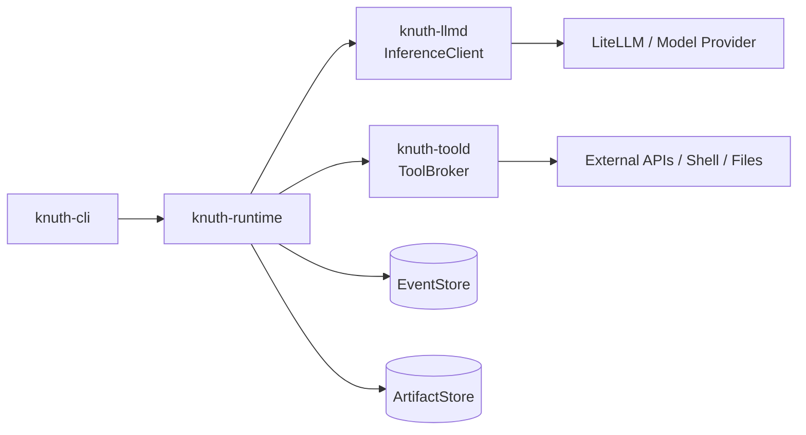
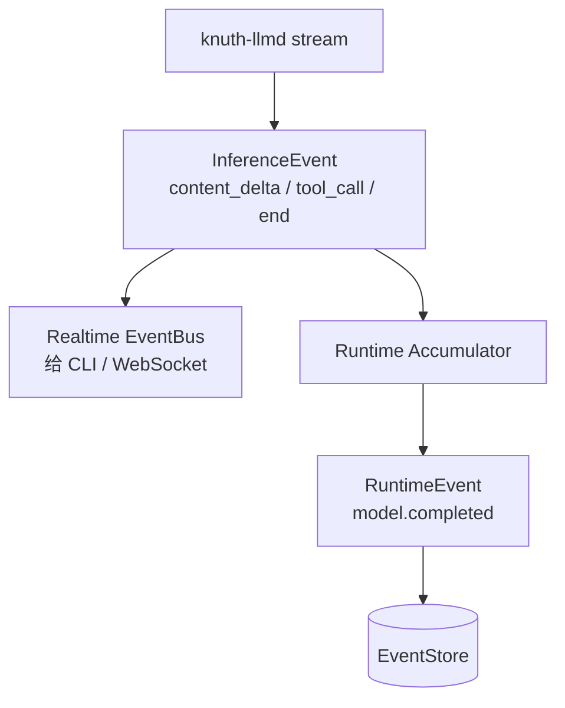
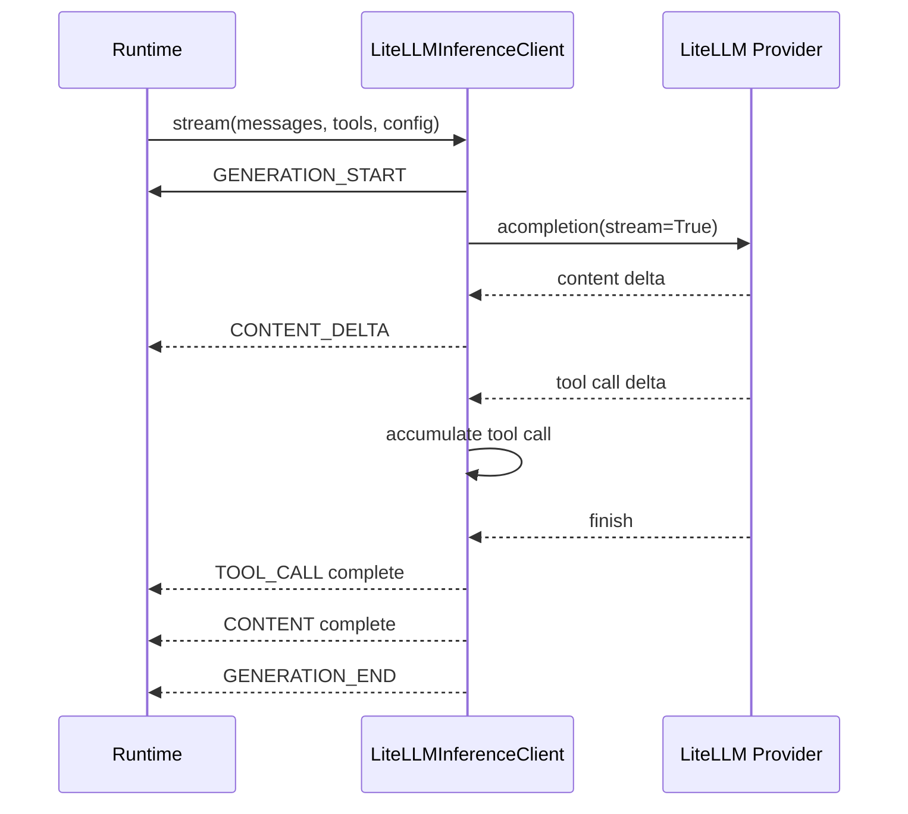
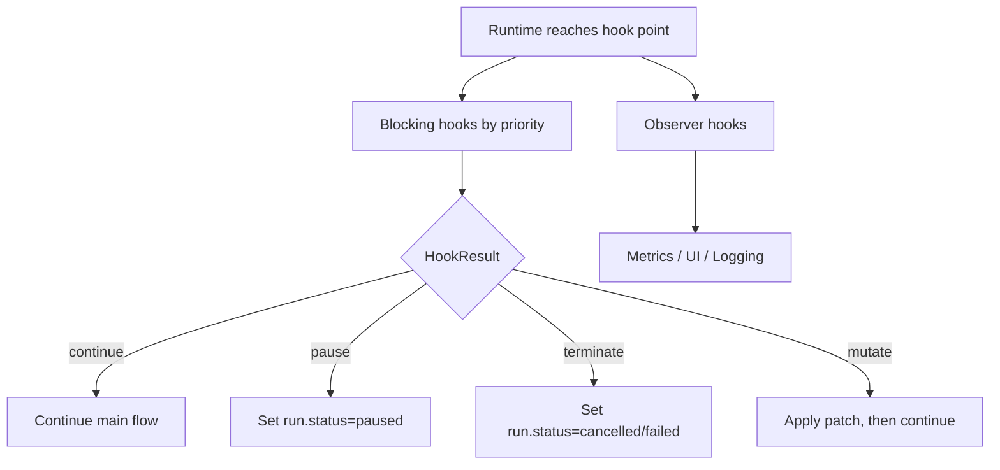
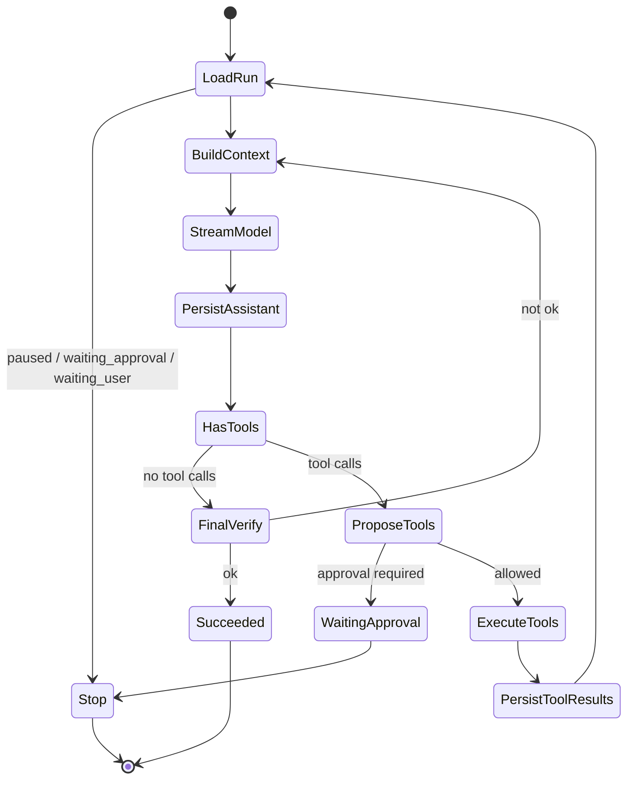
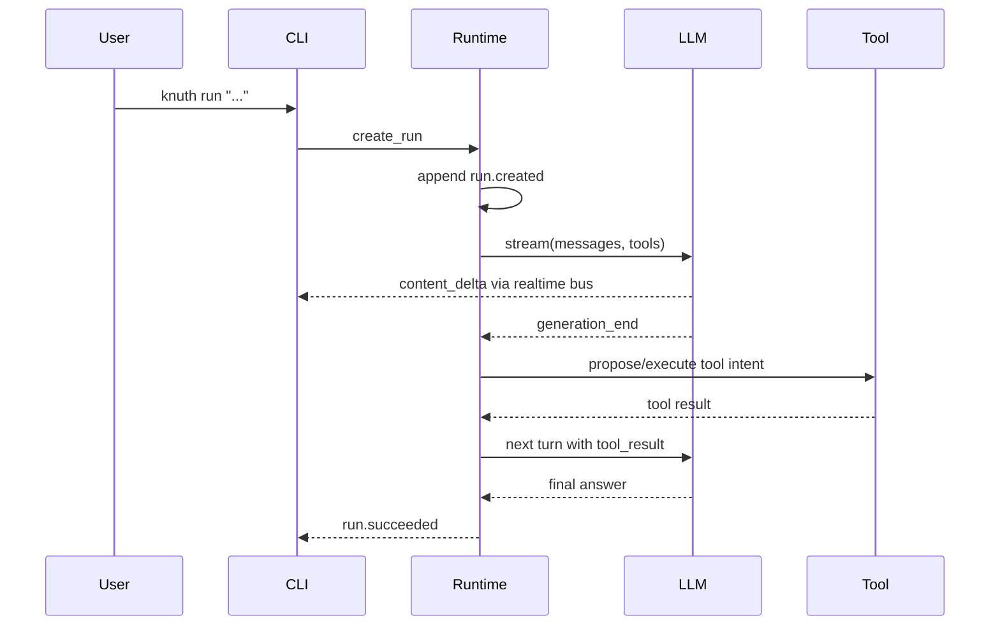
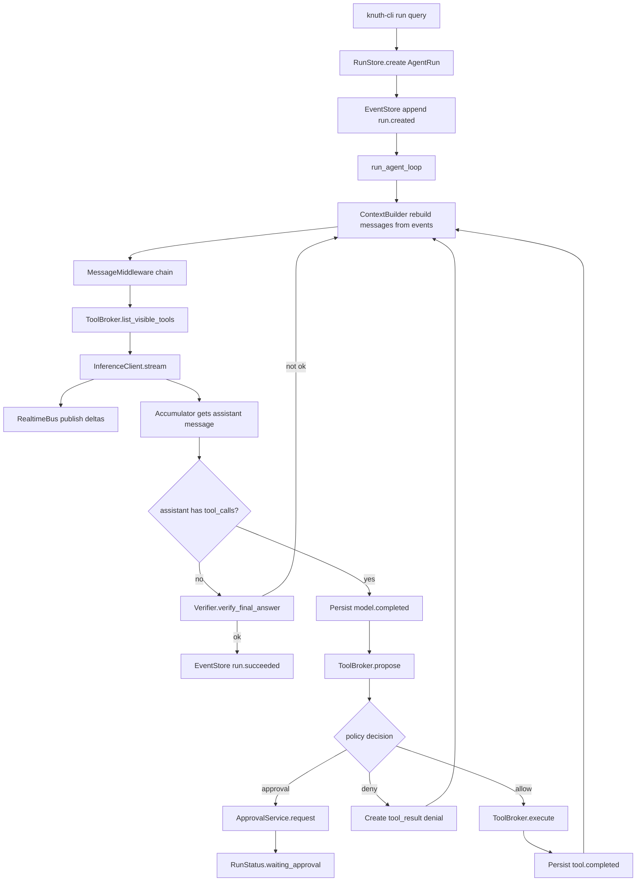

下面是我建议的 **knuth v0 核心方案**。重点不是一次性实现所有高级能力，而是先把边界定对：`LLM 只负责推理和提出意图`，`runtime 负责状态和流程`，`toold 负责工具发现与执行`，`event system 负责可观察和可暂停`。这样 v0 很小，但不会把未来的 daemon、approval、rollback、cache、workflow、plugin 都堵死。


------

## 1. v0 的组件边界

Python 发行包可以用连字符命名，例如 `knuth-runtime`，但 Python import package 建议统一放在 `knuth.*` namespace 下。

建议目录：

```text
knuth/
  core/
    ids.py
    types.py
    messages.py
    events.py
    errors.py
    schemas.py

  llmd/
    client.py
    litellm_client.py
    event_accumulator.py

  toold/
    base.py
    registry.py
    broker.py
    providers.py
    builtin/
      ask_user.py
      read_file.py
      write_file.py
      shell.py

  runtime/
    run.py
    loop.py
    context.py
    middleware.py
    hooks.py
    event_store.py
    artifact_store.py
    approval.py
    policy.py
    services.py

  cli/
    main.py
```

组件职责如下：

```text
knuth-cli
  - 验证流程
  - 创建 run
  - 展示流式输出、timeline、approval
  - 执行 resume / approve / cancel / tools list

knuth-runtime
  - AgentRun 生命周期
  - Agent loop
  - Context 构建与消息中间件
  - EventStore / ArtifactStore / ApprovalService
  - Hook/Event system
  - Policy decision
  - 不直接执行工具

knuth-llmd
  - InferenceClient 抽象
  - LiteLLM provider adapter
  - stream / complete
  - 把 provider 的 streaming chunks 归一化成 InferenceEvent
  - 不知道工具怎么执行

knuth-toold
  - ToolBase / ToolProvider / ToolRegistry
  - ToolBroker.propose / execute
  - 参数校验、并行策略、结果归一化
  - 后续接 Python plugin、subprocess worker、MCP provider

knuth-core
  - 所有组件共享的数据结构
  - Message、ToolIntent、ToolResult、RuntimeEvent、RunStatus 等
```

v0 可以全部 in-process 跑，`knuth-cli` 直接 import runtime、llmd、toold。不要一开始就拆真正的 daemon。包边界先拆好，进程边界以后再加。



LiteLLM 适合作为 v0 provider adapter，因为它官方提供异步 completion、streaming completion，并以 OpenAI-like 格式统一多家模型接口；function calling 和 parallel function calling 也可以通过它接入。v0 不要把 runtime 绑定死在 LiteLLM 上，而是只让 `LiteLLMInferenceClient` 实现 `InferenceClient`。([LiteLLM](https://docs.litellm.ai/docs/completion/stream?utm_source=chatgpt.com))

------

## 2. 两套事件：InferenceEvent 与 RuntimeEvent

这里要先分清楚。

`InferenceEvent` 是 **llmd 内部/流式模型事件**，用于 UI streaming 和 runtime 解析本轮模型输出。

`RuntimeEvent` 是 **runtime 持久化事件**，用于 run timeline、恢复、审计、hook、debug。

不要把每个 `CONTENT_DELTA` 都永久写进 EventStore，否则很快膨胀。v0 可以把 delta 发给实时 EventBus，只持久化 `model.started`、`model.completed`、`tool.started`、`tool.completed`、`approval.requested`、`run.succeeded` 这类 coarse event。



------

## 3. knuth-core：基础类型

建议所有 Pydantic model 都带 `schema_version` 和 `metadata`。你用 `ConfigDict(extra="allow")` 是合理的，尤其适合 v0 向前兼容。Pydantic v2 的 `extra='allow'` 会允许额外字段并存到模型的 extra 字段中，适合事件 payload、工具 metadata 这种以后会扩展的结构。([Pydantic](https://pydantic.dev/docs/validation/latest/api/pydantic/config/?utm_source=chatgpt.com))

```python
# knuth/core/types.py
from __future__ import annotations

from enum import StrEnum
from typing import Any, Literal
from pydantic import BaseModel, ConfigDict, Field


class KnuthModel(BaseModel):
    model_config = ConfigDict(extra="allow")
    schema_version: str = "v0"


class RunStatus(StrEnum):
    CREATED = "created"
    RUNNING = "running"
    WAITING_APPROVAL = "waiting_approval"
    WAITING_USER = "waiting_user"
    PAUSED = "paused"
    FAILED = "failed"
    SUCCEEDED = "succeeded"
    CANCELLED = "cancelled"


class EventDurability(StrEnum):
    TRANSIENT = "transient"
    DURABLE = "durable"


class ErrorInfo(KnuthModel):
    code: str
    message: str
    retryable: bool = False
    details: dict[str, Any] = Field(default_factory=dict)
```

------

## 4. InferenceMessage 设计

你现在的 `InferenceMessage` 有 `user/system/assistant/tool_result` 四类是对的，但还缺几个关键字段：

1. `tool_result` 必须能关联到原始 tool call；
2. `assistant` 必须能携带 tool calls；
3. content 后面可能不只是纯字符串；
4. metadata 要保留 provider/raw 信息。

LiteLLM 的输入参数文档里也有 `tool_call_id` 这类字段，用来表示某条 tool response 是对哪个 tool call 的响应。([LiteLLM](https://docs.litellm.ai/docs/completion/input?utm_source=chatgpt.com))

```python
# knuth/core/messages.py
from __future__ import annotations

from enum import StrEnum
from typing import Any
from pydantic import Field

from .types import KnuthModel


class InferenceRole(StrEnum):
    SYSTEM = "system"
    USER = "user"
    ASSISTANT = "assistant"
    TOOL_RESULT = "tool_result"


class ToolCall(KnuthModel):
    id: str
    name: str
    arguments: dict[str, Any] = Field(default_factory=dict)
    arguments_json: str | None = None
    index: int = 0
    raw: dict[str, Any] = Field(default_factory=dict)


class InferenceMessage(KnuthModel):
    role: InferenceRole
    content: str | None = None

    # assistant message with tool calls
    tool_calls: list[ToolCall] = Field(default_factory=list)

    # tool_result message
    tool_call_id: str | None = None
    tool_name: str | None = None

    name: str | None = None
    metadata: dict[str, Any] = Field(default_factory=dict)

    def to_litellm_message(self) -> dict[str, Any]:
        """
        Convert Knuth message into OpenAI/LiteLLM-ish message.
        Keep this conversion inside llmd, not runtime.
        """
        if self.role == InferenceRole.TOOL_RESULT:
            return {
                "role": "tool",
                "tool_call_id": self.tool_call_id,
                "name": self.tool_name,
                "content": self.content or "",
            }

        msg: dict[str, Any] = {
            "role": self.role.value,
            "content": self.content or "",
        }

        if self.role == InferenceRole.ASSISTANT and self.tool_calls:
            msg["tool_calls"] = [
                {
                    "id": tc.id,
                    "type": "function",
                    "function": {
                        "name": tc.name,
                        "arguments": tc.arguments_json or "",
                    },
                }
                for tc in self.tool_calls
            ]

        return msg
```

------

## 5. knuth-llmd：InferenceClient

建议把 `InferenceClient` 定义成 abstract interface，不要直接写死 LiteLLM。

`complete` 是非流式，适合 summarization、classification、verification 这类无工具调用的小任务。

`stream` 是 agent loop 主路径，返回 `AsyncIterator[InferenceEvent]`。

注意：`InferenceConfig` 应该保持可序列化。`anyio.CancelScope` 这种运行时对象不要塞进 Pydantic model。AnyIO 的 cancellation 是基于 cancel scope 的结构化取消模型，适合作为 runtime options，而不是持久化配置。([AnyIO](https://anyio.readthedocs.io/en/stable/cancellation.html?utm_source=chatgpt.com))

```python
# knuth/llmd/client.py
from __future__ import annotations

from abc import ABC, abstractmethod
from enum import StrEnum
from typing import Any, AsyncIterator, Protocol
from pydantic import Field, PrivateAttr

from knuth.core.types import KnuthModel, ErrorInfo
from knuth.core.messages import InferenceMessage, ToolCall


class InferenceEventType(StrEnum):
    GENERATION_START = "generation_start"
    GENERATION_END = "generation_end"

    CONTENT_DELTA = "content_delta"
    CONTENT = "content"

    REASONING_DELTA = "reasoning_delta"
    REASONING = "reasoning"

    TOOL_CALL = "tool_call"

    ERROR = "error"
    ABORTED = "aborted"


class UsageInfo(KnuthModel):
    input_tokens: int | None = None
    output_tokens: int | None = None
    total_tokens: int | None = None
    cost_usd: float | None = None


class InferenceConfig(KnuthModel):
    model: str
    temperature: float | None = None
    max_output_tokens: int | None = None
    timeout_s: float | None = None

    trace_id: str | None = None
    run_id: str | None = None

    # forwarded to provider adapter when needed
    provider_options: dict[str, Any] = Field(default_factory=dict)


class AbortSignal(Protocol):
    def is_aborted(self) -> bool: ...
    async def checkpoint(self) -> None: ...


class InferenceRuntimeOptions(KnuthModel):
    """
    Non-durable options. Keep runtime-only objects out of InferenceConfig.
    """
    abort_signal: AbortSignal | None = Field(default=None, exclude=True)


class InferenceEvent(KnuthModel):
    type: InferenceEventType
    generation_id: str
    seq: int
    run_id: str | None = None
    payload: dict[str, Any] = Field(default_factory=dict)


class InferenceResult(KnuthModel):
    message: InferenceMessage
    finish_reason: str | None = None
    usage: UsageInfo | None = None
    raw: dict[str, Any] = Field(default_factory=dict)


class InferenceClient(ABC):
    @abstractmethod
    async def stream(
        self,
        messages: list[InferenceMessage],
        tools: list[dict[str, Any]],
        config: InferenceConfig,
        runtime: InferenceRuntimeOptions | None = None,
    ) -> AsyncIterator[InferenceEvent]:
        ...

    @abstractmethod
    async def complete(
        self,
        messages: list[InferenceMessage],
        config: InferenceConfig,
        runtime: InferenceRuntimeOptions | None = None,
    ) -> InferenceResult:
        ...
```

### LiteLLMInferenceClient 的职责

`LiteLLMInferenceClient` 要做三件事：

1. 把 `InferenceMessage` 转成 LiteLLM/OpenAI-like messages；
2. 把 `ToolSpec` 转成 function tool spec；
3. 把 provider streaming chunk 归一化成 `InferenceEvent`。

流式 tool call 建议不要把半截 arguments 暴露给 runtime。内部用 accumulator 拼完整，拼完后发一个完整的 `TOOL_CALL` event。



伪实现骨架：

```python
# knuth/llmd/litellm_client.py
from __future__ import annotations

from typing import AsyncIterator, Any
from uuid import uuid4

from litellm import acompletion

from .client import (
    InferenceClient,
    InferenceConfig,
    InferenceRuntimeOptions,
    InferenceEvent,
    InferenceEventType,
    InferenceResult,
)
from .event_accumulator import StreamAccumulator
from knuth.core.messages import InferenceMessage


class LiteLLMInferenceClient(InferenceClient):
    async def stream(
        self,
        messages: list[InferenceMessage],
        tools: list[dict[str, Any]],
        config: InferenceConfig,
        runtime: InferenceRuntimeOptions | None = None,
    ) -> AsyncIterator[InferenceEvent]:
        generation_id = f"gen_{uuid4().hex}"
        seq = 0

        def ev(t: InferenceEventType, payload: dict[str, Any] | None = None) -> InferenceEvent:
            nonlocal seq
            seq += 1
            return InferenceEvent(
                type=t,
                generation_id=generation_id,
                seq=seq,
                run_id=config.run_id,
                payload=payload or {},
            )

        yield ev(InferenceEventType.GENERATION_START, {"model": config.model})

        if runtime and runtime.abort_signal:
            await runtime.abort_signal.checkpoint()

        accumulator = StreamAccumulator(generation_id=generation_id)

        try:
            response = await acompletion(
                model=config.model,
                messages=[m.to_litellm_message() for m in messages],
                tools=tools or None,
                stream=True,
                temperature=config.temperature,
                max_tokens=config.max_output_tokens,
                timeout=config.timeout_s,
                **config.provider_options,
            )

            async for chunk in response:
                if runtime and runtime.abort_signal and runtime.abort_signal.is_aborted():
                    yield ev(InferenceEventType.ABORTED, {"reason": "abort_signal"})
                    return

                produced = accumulator.feed_chunk(chunk)
                for item in produced:
                    yield ev(item.type, item.payload)

            final_events = accumulator.finish()
            for item in final_events:
                yield ev(item.type, item.payload)

            yield ev(
                InferenceEventType.GENERATION_END,
                {
                    "finish_reason": accumulator.finish_reason,
                    "usage": accumulator.usage,
                    "message": accumulator.to_message().model_dump(),
                },
            )

        except Exception as e:
            yield ev(
                InferenceEventType.ERROR,
                {
                    "code": e.__class__.__name__,
                    "message": str(e),
                    "retryable": False,
                },
            )

    async def complete(
        self,
        messages: list[InferenceMessage],
        config: InferenceConfig,
        runtime: InferenceRuntimeOptions | None = None,
    ) -> InferenceResult:
        if runtime and runtime.abort_signal:
            await runtime.abort_signal.checkpoint()

        response = await acompletion(
            model=config.model,
            messages=[m.to_litellm_message() for m in messages],
            stream=False,
            temperature=config.temperature,
            max_tokens=config.max_output_tokens,
            timeout=config.timeout_s,
            **config.provider_options,
        )

        # Keep provider parsing in one place.
        return parse_litellm_completion_response(response)
```

------

## 6. ToolSpec、ToolBase、ToolManifest 要拆开

你现在的 `ToolBase` 把三件事混在一起了：

1. 给 LLM 看的 function spec；
2. runtime 用的风险、并行、缓存 metadata；
3. 真正的执行代码。

v0 建议拆成：

```text
ToolManifest
  - runtime metadata
  - name, description, parameters, risk, cacheable, parallelable

ToolSpec
  - 发给模型的 function schema
  - 从 ToolManifest 裁剪出来

ToolBase
  - Python 内置工具实现
  - async __call__(ctx, **kwargs) -> ToolResult

ToolProvider
  - 一组工具的来源
  - 可以是 built-in、entry point、subprocess、MCP
# knuth/toold/base.py
from __future__ import annotations

from abc import ABC, abstractmethod
from enum import StrEnum
from typing import Any, Protocol
from pydantic import Field, ConfigDict

from knuth.core.types import KnuthModel, ErrorInfo


class ToolRisk(StrEnum):
    LOW = "low"
    MEDIUM = "medium"
    HIGH = "high"


class ToolEffect(StrEnum):
    PURE = "pure"
    READ = "read"
    LOCAL_WRITE = "local_write"
    EXTERNAL_WRITE = "external_write"
    DANGEROUS = "dangerous"


class ToolManifest(KnuthModel):
    name: str
    description: str
    parameters: dict[str, Any]

    parallelable: bool = False
    cacheable: bool = False

    risk: ToolRisk = ToolRisk.LOW
    effect: ToolEffect = ToolEffect.READ

    provider: str = "builtin"
    metadata: dict[str, Any] = Field(default_factory=dict)

    def to_func_spec(self) -> dict[str, Any]:
        return {
            "type": "function",
            "function": {
                "name": self.name,
                "description": self.description,
                "parameters": self.parameters,
            },
        }


class ToolContext(KnuthModel):
    run_id: str
    tool_call_id: str
    workspace_uri: str | None = None

    # service handles can be injected outside pydantic if needed
    metadata: dict[str, Any] = Field(default_factory=dict)


class ToolResultStatus(StrEnum):
    SUCCESS = "success"
    ERROR = "error"


class ToolResult(KnuthModel):
    status: ToolResultStatus
    content: str | None = None
    data: Any = None

    error: ErrorInfo | None = None
    artifacts: list[str] = Field(default_factory=list)
    metadata: dict[str, Any] = Field(default_factory=dict)

    def to_observation_text(self) -> str:
        if self.status == ToolResultStatus.SUCCESS:
            return self.content or repr(self.data)
        return f"Tool error: {self.error.message if self.error else 'unknown error'}"


class ToolBase(KnuthModel, ABC):
    model_config = ConfigDict(extra="allow")

    name: str
    description: str
    parameters: dict[str, Any]

    parallelable: bool = False
    cacheable: bool = False
    risk: ToolRisk = ToolRisk.LOW
    effect: ToolEffect = ToolEffect.READ

    def manifest(self) -> ToolManifest:
        return ToolManifest(
            name=self.name,
            description=self.description,
            parameters=self.parameters,
            parallelable=self.parallelable,
            cacheable=self.cacheable,
            risk=self.risk,
            effect=self.effect,
            provider="builtin",
        )

    def to_func_spec(self) -> dict[str, Any]:
        return self.manifest().to_func_spec()

    @abstractmethod
    async def __call__(self, ctx: ToolContext, **kwargs: Any) -> ToolResult:
        ...
```

你原来的 `cachable` 建议改成 `cacheable`。如果担心兼容，可以在模型里做 alias。

------

## 7. ToolProvider：解决“像 TS 一样运行时注入三方功能”

在 Python 里，不建议一上来让第三方直接把任意 function 注入主进程。更好的 v0 设计是 `ToolProvider`。

```python
# knuth/toold/providers.py
from __future__ import annotations

from typing import Any, Protocol

from knuth.core.messages import ToolCall
from .base import ToolManifest, ToolResult, ToolContext


class ToolProvider(Protocol):
    name: str

    async def list_tools(self) -> list[ToolManifest]:
        ...

    async def call_tool(
        self,
        name: str,
        args: dict[str, Any],
        ctx: ToolContext,
    ) -> ToolResult:
        ...
```

然后做四种 provider：

```text
BuiltinToolProvider
  - 直接注册 Python ToolBase
  - v0 主力

EntryPointToolProvider
  - 通过 Python package entry points 发现第三方工具
  - 适合 pip install knuth-tool-xxx 后自动发现

SubprocessToolProvider
  - 第三方工具跑在子进程
  - 更安全，适合非信任工具

McpToolProvider
  - 后续接 MCP server
  - 工具列表可动态变化
```

Python packaging 的 entry points 本来就是让安装包向宿主程序暴露可发现组件的机制，很适合 `pip install knuth-tool-foo` 后被 `ToolRegistry` 自动发现。([Python Packaging](https://packaging.python.org/specifications/entry-points/?utm_source=chatgpt.com))

示例 `pyproject.toml`：

```toml
[project.entry-points."knuth.tools"]
file_tools = "knuth_file_tools:provider_factory"
github_tools = "knuth_github_tools:provider_factory"
```

加载：

```python
# knuth/toold/registry.py
from __future__ import annotations

from importlib.metadata import entry_points
from typing import Any

from .providers import ToolProvider
from .base import ToolManifest, ToolBase, ToolContext, ToolResult


class BuiltinToolProvider:
    name = "builtin"

    def __init__(self) -> None:
        self._tools: dict[str, ToolBase] = {}

    def register(self, tool: ToolBase) -> None:
        self._tools[tool.name] = tool

    async def list_tools(self) -> list[ToolManifest]:
        return [tool.manifest() for tool in self._tools.values()]

    async def call_tool(
        self,
        name: str,
        args: dict[str, Any],
        ctx: ToolContext,
    ) -> ToolResult:
        return await self._tools[name](ctx, **args)


class ToolRegistry:
    def __init__(self) -> None:
        self._providers: dict[str, ToolProvider] = {}
        self._manifest_index: dict[str, tuple[ToolManifest, str]] = {}

    def add_provider(self, provider: ToolProvider) -> None:
        self._providers[provider.name] = provider

    async def refresh(self) -> None:
        self._manifest_index.clear()
        for provider_name, provider in self._providers.items():
            for manifest in await provider.list_tools():
                self._manifest_index[manifest.name] = (manifest, provider_name)

    async def discover_entry_points(self, group: str = "knuth.tools") -> None:
        eps = entry_points(group=group)
        for ep in eps:
            factory = ep.load()
            provider = factory()
            self.add_provider(provider)
        await self.refresh()

    def get_manifest(self, name: str) -> ToolManifest:
        return self._manifest_index[name][0]

    def get_provider_for_tool(self, name: str) -> ToolProvider:
        provider_name = self._manifest_index[name][1]
        return self._providers[provider_name]

    def list_visible_manifests(self) -> list[ToolManifest]:
        return [item[0] for item in self._manifest_index.values()]
```

后续如果接 MCP，可以让 `McpToolProvider` 监听工具列表变化。MCP tools spec 里有 `listChanged` 能力，server 可以声明工具列表变化时发 `notifications/tools/list_changed` 通知，这正好对应 `ToolRegistry.refresh()`。([Model Context Protocol](https://modelcontextprotocol.io/specification/2025-03-26/server/tools?utm_source=chatgpt.com))

------

## 8. ToolIntent、ToolProposal、ToolBroker

LLM 产出的不是 ToolResult，而是 ToolIntent。

```python
# knuth/toold/broker.py
from __future__ import annotations

from enum import StrEnum
from typing import Any
from pydantic import Field

from knuth.core.types import KnuthModel, ErrorInfo
from knuth.core.messages import ToolCall, InferenceMessage, InferenceRole
from .base import ToolContext, ToolResult, ToolResultStatus
from .registry import ToolRegistry


class ToolProposalStatus(StrEnum):
    ALLOWED = "allowed"
    REQUIRES_APPROVAL = "requires_approval"
    DENIED = "denied"


class ToolIntent(KnuthModel):
    id: str
    name: str
    arguments: dict[str, Any]
    index: int = 0
    raw: dict[str, Any] = Field(default_factory=dict)


class ApprovalRequest(KnuthModel):
    id: str
    run_id: str
    title: str
    reason: str
    risk: str
    payload: dict[str, Any]
    metadata: dict[str, Any] = Field(default_factory=dict)


class ToolProposal(KnuthModel):
    status: ToolProposalStatus
    intent: ToolIntent
    normalized_args: dict[str, Any] = Field(default_factory=dict)
    approval: ApprovalRequest | None = None
    error: ErrorInfo | None = None


class ToolExecutionRecord(KnuthModel):
    intent: ToolIntent
    result: ToolResult

    def to_tool_result_message(self) -> InferenceMessage:
        return InferenceMessage(
            role=InferenceRole.TOOL_RESULT,
            tool_call_id=self.intent.id,
            tool_name=self.intent.name,
            content=self.result.to_observation_text(),
            metadata={
                "tool_status": self.result.status.value,
                "artifacts": self.result.artifacts,
            },
        )
```

`ToolBroker` 做这些事：

1. 工具是否存在；
2. 参数校验；
3. policy 判断；
4. approval 判断；
5. 执行；
6. 并行或串行；
7. 结果转成 tool_result message。

```python
class ToolBroker:
    def __init__(
        self,
        registry: ToolRegistry,
        policy_engine: "PolicyEngine",
    ) -> None:
        self.registry = registry
        self.policy_engine = policy_engine

    async def list_visible_tools(self, run_id: str) -> list[dict[str, Any]]:
        manifests = self.registry.list_visible_manifests()
        # v0: all visible. Later filter by run/user/project/policy.
        return [m.to_func_spec() for m in manifests]

    async def propose(self, run_id: str, intent: ToolIntent) -> ToolProposal:
        try:
            manifest = self.registry.get_manifest(intent.name)
        except KeyError:
            return ToolProposal(
                status=ToolProposalStatus.DENIED,
                intent=intent,
                error=ErrorInfo(
                    code="tool_not_found",
                    message=f"Tool not found: {intent.name}",
                    retryable=False,
                ),
            )

        # v0: basic JSON-schema validation can be added here.
        normalized_args = intent.arguments

        decision = await self.policy_engine.evaluate_tool_call(
            run_id=run_id,
            manifest=manifest,
            args=normalized_args,
        )

        if decision.kind == "deny":
            return ToolProposal(
                status=ToolProposalStatus.DENIED,
                intent=intent,
                normalized_args=normalized_args,
                error=decision.error,
            )

        if decision.kind == "approval":
            return ToolProposal(
                status=ToolProposalStatus.REQUIRES_APPROVAL,
                intent=intent,
                normalized_args=normalized_args,
                approval=decision.approval,
            )

        return ToolProposal(
            status=ToolProposalStatus.ALLOWED,
            intent=intent,
            normalized_args=normalized_args,
        )

    async def execute(self, run_id: str, proposal: ToolProposal) -> ToolExecutionRecord:
        provider = self.registry.get_provider_for_tool(proposal.intent.name)
        ctx = ToolContext(
            run_id=run_id,
            tool_call_id=proposal.intent.id,
        )
        result = await provider.call_tool(
            proposal.intent.name,
            proposal.normalized_args,
            ctx,
        )
        return ToolExecutionRecord(intent=proposal.intent, result=result)
```

### 多工具调用与并行

v0 不要让 agent loop 一个个乱处理 tool call delta。建议本轮模型输出结束后，拿到完整 `tool_calls`，形成 `ToolBatchIntent`。

```python
class ToolBatchIntent(KnuthModel):
    run_id: str
    assistant_message_id: str
    intents: list[ToolIntent]
```

执行策略：

```text
如果 tool_calls 为空：
  content 是 final answer candidate

如果 tool_calls 非空：
  先持久化 assistant message with tool_calls
  再逐个 propose

如果任意 proposal requires_approval：
  创建 approval
  run.status = waiting_approval
  return

如果全部 allowed：
  如果所有 tool manifest.parallelable=True：
      并行执行，但按原 index 顺序返回 tool_result messages
  否则：
      串行执行
```

并行不要太早激进。v0 可以先串行，保留 `parallelable` 字段。真正并行时，推荐用 AnyIO task group，因为后续 cancellation、timeout、structured concurrency 会更清楚。

------

## 9. PolicyEngine 与 ApprovalService

v0 的 policy 不要复杂，但接口要有。

```python
# knuth/runtime/policy.py
from __future__ import annotations

from enum import StrEnum
from pydantic import Field

from knuth.core.types import KnuthModel, ErrorInfo
from knuth.toold.base import ToolManifest, ToolRisk, ToolEffect
from knuth.toold.broker import ApprovalRequest


class PolicyDecisionKind(StrEnum):
    ALLOW = "allow"
    DENY = "deny"
    APPROVAL = "approval"


class PolicyDecision(KnuthModel):
    kind: PolicyDecisionKind
    approval: ApprovalRequest | None = None
    error: ErrorInfo | None = None


class PolicyEngine:
    async def evaluate_tool_call(
        self,
        run_id: str,
        manifest: ToolManifest,
        args: dict,
    ) -> PolicyDecision:
        if manifest.effect in {ToolEffect.EXTERNAL_WRITE, ToolEffect.DANGEROUS}:
            return PolicyDecision(
                kind=PolicyDecisionKind.APPROVAL,
                approval=ApprovalRequest(
                    id=f"appr_{run_id}_{manifest.name}",
                    run_id=run_id,
                    title=f"Approve tool call: {manifest.name}",
                    reason=f"Tool has effect={manifest.effect.value}, risk={manifest.risk.value}",
                    risk=manifest.risk.value,
                    payload={
                        "tool": manifest.name,
                        "args_preview": args,
                    },
                ),
            )

        if manifest.risk == ToolRisk.HIGH:
            return PolicyDecision(
                kind=PolicyDecisionKind.APPROVAL,
                approval=ApprovalRequest(
                    id=f"appr_{run_id}_{manifest.name}",
                    run_id=run_id,
                    title=f"Approve high-risk tool: {manifest.name}",
                    reason="Tool is marked high risk.",
                    risk=manifest.risk.value,
                    payload={
                        "tool": manifest.name,
                        "args_preview": args,
                    },
                ),
            )

        return PolicyDecision(kind=PolicyDecisionKind.ALLOW)
```

ApprovalService：

```python
# knuth/runtime/approval.py
from __future__ import annotations

from enum import StrEnum
from typing import Any
from pydantic import Field

from knuth.core.types import KnuthModel


class ApprovalStatus(StrEnum):
    PENDING = "pending"
    APPROVED = "approved"
    DENIED = "denied"
    EXPIRED = "expired"


class Approval(KnuthModel):
    id: str
    run_id: str
    status: ApprovalStatus
    title: str
    reason: str
    risk: str
    payload: dict[str, Any]
    created_at: str
    resolved_at: str | None = None
    metadata: dict[str, Any] = Field(default_factory=dict)


class ApprovalService:
    async def request(self, approval: Approval) -> Approval:
        ...

    async def resolve(self, approval_id: str, status: ApprovalStatus) -> Approval:
        ...

    async def list_pending(self, run_id: str | None = None) -> list[Approval]:
        ...
```

------

## 10. AgentRun 与 EventStore

`AgentRun` 保存一次用户请求的总状态。不要把所有 messages 都塞进 `AgentRun` 字段里；messages 应该从 EventStore 重建，或者通过 projection 缓存。

```python
# knuth/runtime/run.py
from __future__ import annotations

from typing import Any
from pydantic import Field

from knuth.core.types import KnuthModel, RunStatus


class AgentRun(KnuthModel):
    id: str
    user_id: str | None = None
    query: str
    status: RunStatus = RunStatus.CREATED

    created_at: str
    updated_at: str

    parent_run_id: str | None = None
    title: str | None = None

    max_turns: int = 32

    budget: dict[str, Any] = Field(default_factory=dict)
    metadata: dict[str, Any] = Field(default_factory=dict)
```

RuntimeEvent：

```python
# knuth/core/events.py
from __future__ import annotations

from typing import Any
from pydantic import Field

from .types import KnuthModel, EventDurability


class RuntimeEvent(KnuthModel):
    id: str
    run_id: str
    seq: int

    namespace: str
    name: str
    type: str

    payload: dict[str, Any] = Field(default_factory=dict)

    durability: EventDurability = EventDurability.DURABLE
    causation_id: str | None = None
    correlation_id: str | None = None

    created_at: str
```

EventStore：

```python
# knuth/runtime/event_store.py
from __future__ import annotations

from typing import Any, Protocol

from knuth.core.events import RuntimeEvent
from knuth.core.types import EventDurability


class EventStore(Protocol):
    async def append(
        self,
        run_id: str,
        namespace: str,
        name: str,
        payload: dict[str, Any],
        durability: EventDurability = EventDurability.DURABLE,
        causation_id: str | None = None,
        correlation_id: str | None = None,
    ) -> RuntimeEvent:
        ...

    async def list_events(
        self,
        run_id: str,
        after_seq: int | None = None,
    ) -> list[RuntimeEvent]:
        ...
```

v0 可以有两个实现：

```text
MemoryEventStore
  - 单测和快速 demo

SQLiteEventStore
  - knuth-cli 默认
  - ~/.knuth/knuth.db
```

SQLite 表大概是：

```sql
create table runs (
  id text primary key,
  status text not null,
  query text not null,
  created_at text not null,
  updated_at text not null,
  data_json text not null
);

create table events (
  id text primary key,
  run_id text not null,
  seq integer not null,
  namespace text not null,
  name text not null,
  type text not null,
  payload_json text not null,
  durability text not null,
  created_at text not null,
  unique(run_id, seq)
);

create table approvals (
  id text primary key,
  run_id text not null,
  status text not null,
  data_json text not null,
  created_at text not null,
  resolved_at text
);

create table artifacts (
  id text primary key,
  run_id text not null,
  kind text not null,
  uri text not null,
  title text,
  metadata_json text not null,
  created_at text not null
);
```

------

## 11. 消息中间件：Context 与 ContextBuilder

你提到 `class Conetxt`，建议拼成 `Context`，但更准确地说有两个概念：

```text
RunContext
  - 当前 run 的服务、配置、状态

ContextView
  - 即将发给 LLM 的 messages + tools
  - 会被 middleware 修改
# knuth/runtime/context.py
from __future__ import annotations

from typing import Any
from pydantic import Field

from knuth.core.types import KnuthModel
from knuth.core.messages import InferenceMessage


class RunContext(KnuthModel):
    run_id: str
    user_id: str | None = None
    workspace_uri: str | None = None
    metadata: dict[str, Any] = Field(default_factory=dict)


class ContextView(KnuthModel):
    run_id: str
    messages: list[InferenceMessage]
    tools: list[dict[str, Any]]

    diagnostics: dict[str, Any] = Field(default_factory=dict)
    metadata: dict[str, Any] = Field(default_factory=dict)
```

Middleware 接口：

```python
# knuth/runtime/middleware.py
from __future__ import annotations

from abc import ABC, abstractmethod

from .context import RunContext, ContextView


class MessageMiddleware(ABC):
    name: str
    priority: int = 100

    @abstractmethod
    async def process(
        self,
        ctx: RunContext,
        view: ContextView,
    ) -> ContextView:
        ...
```

v0 可以内置几个 middleware：

```text
SystemPromptMiddleware
  - 注入 knuth 系统提示

ToolFilterMiddleware
  - 根据 policy/project 过滤工具

HistoryCompactionMiddleware
  - 简单压缩历史，只保留最近 N 轮
  - v0 可以先不做复杂 summarization

SensitiveContentFilterMiddleware
  - 过滤不该送进模型的 metadata/secrets

BudgetMiddleware
  - 控制最大消息数或近似 token
```

ContextBuilder 负责从 EventStore 重建消息：

```python
class ContextBuilder:
    def __init__(
        self,
        event_store: EventStore,
        tool_broker: "ToolBroker",
        middlewares: list[MessageMiddleware],
    ) -> None:
        self.event_store = event_store
        self.tool_broker = tool_broker
        self.middlewares = sorted(middlewares, key=lambda m: m.priority)

    async def build(self, ctx: RunContext) -> ContextView:
        events = await self.event_store.list_events(ctx.run_id)

        messages = reconstruct_messages_from_events(events)
        tools = await self.tool_broker.list_visible_tools(ctx.run_id)

        view = ContextView(
            run_id=ctx.run_id,
            messages=messages,
            tools=tools,
        )

        for mw in self.middlewares:
            view = await mw.process(ctx, view)

        return view
```

消息重建规则：

```text
run.created / user.message
  -> user message

model.completed
  -> assistant message
  -> 如果有 tool_calls，要保留在 assistant message 上

tool.completed
  -> tool_result message

user_input.received
  -> user message

system.note
  -> system 或 assistant metadata，视具体用途
```

------

## 12. Hook/Event system

你要的“带命名空间事件系统，第三方可扩展，用户通过返回值暂停、终止或继续”，建议分成两类 hook：

```text
observer hook
  - 只观察事件
  - 不改变流程
  - 可并发执行
  - 失败不阻断主流程

blocking hook
  - 在关键点执行
  - 可返回 continue / pause / terminate / mutate
  - 按 priority 串行执行
  - 失败默认阻断或按策略处理
# knuth/runtime/hooks.py
from __future__ import annotations

from enum import StrEnum
from typing import Any, Protocol
from pydantic import Field

from knuth.core.types import KnuthModel


class HookAction(StrEnum):
    CONTINUE = "continue"
    PAUSE = "pause"
    TERMINATE = "terminate"
    MUTATE = "mutate"


class HookResult(KnuthModel):
    action: HookAction = HookAction.CONTINUE
    reason: str | None = None
    patch: dict[str, Any] = Field(default_factory=dict)


class HookContext(KnuthModel):
    run_id: str
    namespace: str
    name: str
    payload: dict[str, Any]
    metadata: dict[str, Any] = Field(default_factory=dict)


class HookHandler(Protocol):
    async def __call__(self, ctx: HookContext) -> HookResult:
        ...


class HookRegistration(KnuthModel):
    namespace: str
    name: str
    handler_id: str
    priority: int = 100
    blocking: bool = False
    timeout_s: float | None = None
```

HookManager：

```python
class HookManager:
    def __init__(self) -> None:
        self._blocking: list[tuple[HookRegistration, HookHandler]] = []
        self._observers: list[tuple[HookRegistration, HookHandler]] = []

    def register(self, reg: HookRegistration, handler: HookHandler) -> None:
        if reg.blocking:
            self._blocking.append((reg, handler))
            self._blocking.sort(key=lambda x: x[0].priority)
        else:
            self._observers.append((reg, handler))

    async def dispatch_blocking(self, ctx: HookContext) -> HookResult:
        for reg, handler in self._matching(self._blocking, ctx):
            result = await handler(ctx)
            if result.action != HookAction.CONTINUE:
                return result
        return HookResult(action=HookAction.CONTINUE)

    async def emit_observer(self, ctx: HookContext) -> None:
        # v0 可以串行；v0.1 再用 task group 并发。
        for reg, handler in self._matching(self._observers, ctx):
            try:
                await handler(ctx)
            except Exception:
                # observer failure should not break the agent loop
                pass

    def _matching(self, items, ctx: HookContext):
        for reg, handler in items:
            if reg.namespace == ctx.namespace and reg.name == ctx.name:
                yield reg, handler
```

建议 v0 先支持这些 hook point：

```text
run.before_step
run.after_step
run.before_finish

context.before_build
context.after_build

model.before_stream
model.after_stream
model.error

tool.before_propose
tool.after_propose
tool.before_execute
tool.after_execute

approval.before_request
approval.after_resolve
```

流程图：



------

## 13. Agent loop v0

核心原则：agent loop 不直接执行工具。它只处理模型输出，形成 `ToolIntent`，交给 `ToolBroker`。

还有一个建议：`need_clarification` 不要靠解析模型文本。v0 做一个内置控制工具 `knuth.ask_user`。模型需要问用户时，就调用这个工具。runtime 识别到它后，把 run 状态设为 `waiting_user`。

内置工具：

```text
knuth.ask_user
  effect: pure
  risk: low
  参数: question: string
  runtime 特殊处理：不真正执行外部动作，而是生成 user_input.requested event

knuth.finish
  可选
  如果你想强制 final answer 结构化，可以做成 finish tool
  v0 也可以不用，模型不调用 tool 时就视为 final answer candidate
```

Agent loop 主流程：



核心代码骨架：

```python
# knuth/runtime/loop.py
from __future__ import annotations

from typing import Any

from knuth.core.types import RunStatus, EventDurability
from knuth.core.messages import InferenceMessage, InferenceRole
from knuth.llmd.client import (
    InferenceClient,
    InferenceConfig,
    InferenceRuntimeOptions,
    InferenceEventType,
)
from knuth.toold.broker import (
    ToolBroker,
    ToolIntent,
    ToolProposalStatus,
)
from .context import RunContext
from .services import RuntimeServices
from .hooks import HookContext, HookAction


async def run_agent_loop(
    run_id: str,
    services: RuntimeServices,
    inference_config: InferenceConfig,
    runtime_options: InferenceRuntimeOptions | None = None,
) -> RunStatus:
    """
    v0 global loop entry.
    Can be called by knuth-cli now, knuth-runtime daemon later.
    """
    turns = 0

    while True:
        run = await services.run_store.get(run_id)

        if run.status in {
            RunStatus.PAUSED,
            RunStatus.WAITING_APPROVAL,
            RunStatus.WAITING_USER,
            RunStatus.SUCCEEDED,
            RunStatus.FAILED,
            RunStatus.CANCELLED,
        }:
            return run.status

        if turns >= run.max_turns:
            await services.run_store.set_status(run_id, RunStatus.FAILED)
            await services.event_store.append(
                run_id,
                namespace="run",
                name="failed",
                payload={"reason": "max_turns_exceeded", "max_turns": run.max_turns},
            )
            return RunStatus.FAILED

        turns += 1

        hook_result = await services.hooks.dispatch_blocking(
            HookContext(
                run_id=run_id,
                namespace="run",
                name="before_step",
                payload={"turn": turns},
            )
        )
        if hook_result.action == HookAction.PAUSE:
            await services.run_store.set_status(run_id, RunStatus.PAUSED)
            return RunStatus.PAUSED
        if hook_result.action == HookAction.TERMINATE:
            await services.run_store.set_status(run_id, RunStatus.CANCELLED)
            return RunStatus.CANCELLED

        ctx = RunContext(
            run_id=run_id,
            user_id=run.user_id,
            workspace_uri=run.metadata.get("workspace_uri"),
        )

        view = await services.context_builder.build(ctx)

        await services.event_store.append(
            run_id,
            namespace="model",
            name="started",
            payload={
                "turn": turns,
                "model": inference_config.model,
                "message_count": len(view.messages),
                "tool_count": len(view.tools),
            },
        )

        assistant_message = None
        stream_error = None

        async for event in services.inference_client.stream(
            messages=view.messages,
            tools=view.tools,
            config=inference_config.model_copy(update={"run_id": run_id}),
            runtime=runtime_options,
        ):
            # Send all inference events to realtime bus.
            await services.realtime_bus.publish(run_id, event)

            if event.type == InferenceEventType.ERROR:
                stream_error = event.payload
                break

            if event.type == InferenceEventType.ABORTED:
                await services.event_store.append(
                    run_id,
                    namespace="model",
                    name="aborted",
                    payload=event.payload,
                )
                await services.run_store.set_status(run_id, RunStatus.PAUSED)
                return RunStatus.PAUSED

            if event.type == InferenceEventType.GENERATION_END:
                assistant_message = InferenceMessage.model_validate(
                    event.payload["message"]
                )

        if stream_error:
            await services.event_store.append(
                run_id,
                namespace="model",
                name="failed",
                payload=stream_error,
            )
            await services.run_store.set_status(run_id, RunStatus.FAILED)
            return RunStatus.FAILED

        if assistant_message is None:
            await services.event_store.append(
                run_id,
                namespace="model",
                name="failed",
                payload={"reason": "missing_generation_end"},
            )
            await services.run_store.set_status(run_id, RunStatus.FAILED)
            return RunStatus.FAILED

        await services.event_store.append(
            run_id,
            namespace="model",
            name="completed",
            payload={
                "turn": turns,
                "assistant_message": assistant_message.model_dump(),
            },
        )

        if assistant_message.tool_calls:
            status = await handle_tool_calls(
                run_id=run_id,
                assistant_message=assistant_message,
                services=services,
            )
            if status is not None:
                return status
            continue

        verified = await services.verifier.verify_final_answer(
            run_id=run_id,
            message=assistant_message,
        )

        if verified.ok:
            await services.event_store.append(
                run_id,
                namespace="run",
                name="succeeded",
                payload={
                    "answer": assistant_message.content,
                    "turns": turns,
                },
            )
            await services.run_store.set_status(run_id, RunStatus.SUCCEEDED)
            return RunStatus.SUCCEEDED

        await services.event_store.append(
            run_id,
            namespace="verification",
            name="failed",
            payload=verified.model_dump(),
        )
```

`handle_tool_calls`：

```python
async def handle_tool_calls(
    run_id: str,
    assistant_message: InferenceMessage,
    services: RuntimeServices,
) -> RunStatus | None:
    intents = [
        ToolIntent(
            id=tc.id,
            name=tc.name,
            arguments=tc.arguments,
            index=tc.index,
            raw=tc.raw,
        )
        for tc in assistant_message.tool_calls
    ]

    # Special control tool: ask user.
    for intent in intents:
        if intent.name == "knuth.ask_user":
            question = intent.arguments.get("question", "")
            await services.event_store.append(
                run_id,
                namespace="user_input",
                name="requested",
                payload={"question": question, "tool_call_id": intent.id},
            )
            await services.run_store.set_status(run_id, RunStatus.WAITING_USER)
            return RunStatus.WAITING_USER

    proposals = []
    for intent in intents:
        await services.event_store.append(
            run_id,
            namespace="tool",
            name="intent",
            payload=intent.model_dump(),
        )

        proposal = await services.tool_broker.propose(run_id, intent)

        await services.event_store.append(
            run_id,
            namespace="tool",
            name="proposed",
            payload=proposal.model_dump(),
        )

        if proposal.status == ToolProposalStatus.DENIED:
            # Turn denial into tool_result so model can recover next turn.
            error_result_msg = InferenceMessage(
                role=InferenceRole.TOOL_RESULT,
                tool_call_id=intent.id,
                tool_name=intent.name,
                content=f"Tool call denied: {proposal.error.message if proposal.error else 'unknown'}",
            )
            await services.event_store.append(
                run_id,
                namespace="tool",
                name="completed",
                payload={
                    "intent": intent.model_dump(),
                    "message": error_result_msg.model_dump(),
                    "denied": True,
                },
            )
            continue

        if proposal.status == ToolProposalStatus.REQUIRES_APPROVAL:
            approval = await services.approvals.request_from_proposal(proposal)
            await services.event_store.append(
                run_id,
                namespace="approval",
                name="requested",
                payload=approval.model_dump(),
            )
            await services.run_store.set_status(run_id, RunStatus.WAITING_APPROVAL)
            return RunStatus.WAITING_APPROVAL

        proposals.append(proposal)

    # v0: execute serially first. Later batch parallel execution.
    for proposal in proposals:
        await services.event_store.append(
            run_id,
            namespace="tool",
            name="started",
            payload={"intent": proposal.intent.model_dump()},
        )

        record = await services.tool_broker.execute(run_id, proposal)
        tool_msg = record.to_tool_result_message()

        await services.event_store.append(
            run_id,
            namespace="tool",
            name="completed",
            payload={
                "intent": proposal.intent.model_dump(),
                "result": record.result.model_dump(),
                "message": tool_msg.model_dump(),
            },
        )

    return None
```

------

## 14. RuntimeServices：依赖集中注入

不要让 `run_agent_loop` 传十几个参数。做一个 services container。

```python
# knuth/runtime/services.py
from __future__ import annotations

from pydantic import Field

from knuth.core.types import KnuthModel
from knuth.llmd.client import InferenceClient
from knuth.toold.broker import ToolBroker
from .event_store import EventStore
from .context import ContextBuilder
from .hooks import HookManager


class RuntimeServices(KnuthModel):
    inference_client: InferenceClient = Field(exclude=True)
    tool_broker: ToolBroker = Field(exclude=True)

    run_store: "RunStore" = Field(exclude=True)
    event_store: EventStore = Field(exclude=True)
    artifact_store: "ArtifactStore" = Field(exclude=True)
    approvals: "ApprovalService" = Field(exclude=True)
    context_builder: ContextBuilder = Field(exclude=True)
    hooks: HookManager = Field(exclude=True)
    realtime_bus: "RealtimeBus" = Field(exclude=True)
    verifier: "Verifier" = Field(exclude=True)
```

------

## 15. RealtimeBus 与 EventStore 的关系

v0 可以很简单：

```python
class RealtimeBus:
    async def publish(self, run_id: str, event: object) -> None:
        ...

    async def subscribe(self, run_id: str):
        ...
```

CLI 里直接打印：

```text
CONTENT_DELTA -> stdout
REASONING_DELTA -> 如果 debug 模式打开再显示
TOOL_CALL -> 显示 "model wants to call X"
GENERATION_END -> 换行
```

EventStore 只保存最终形态：

```text
model.started
model.completed
tool.intent
tool.proposed
tool.started
tool.completed
approval.requested
run.succeeded
run.failed
```

------

## 16. ArtifactStore

v0 可以先做文件系统 artifact store。

```python
class Artifact(KnuthModel):
    id: str
    run_id: str
    kind: str
    title: str | None = None
    uri: str
    metadata: dict[str, Any] = Field(default_factory=dict)
    created_at: str


class ArtifactStore:
    async def put_text(
        self,
        run_id: str,
        kind: str,
        title: str,
        content: str,
        metadata: dict[str, Any] | None = None,
    ) -> Artifact:
        ...

    async def get_text(self, artifact_id: str) -> str:
        ...
```

目录：

```text
~/.knuth/
  knuth.db
  artifacts/
    run_xxx/
      artifact_001.md
      artifact_002.json
```

后面 AgentFS 可以直接挂这里：

```text
/runs/<run_id>/events
/runs/<run_id>/artifacts
/artifacts/<artifact_id>
/approvals/pending
/tools
```

------

## 17. Verifier v0

v0 不要复杂。先定义接口：

```python
class VerificationResult(KnuthModel):
    ok: bool
    reason: str | None = None
    metadata: dict[str, Any] = Field(default_factory=dict)


class Verifier:
    async def verify_final_answer(
        self,
        run_id: str,
        message: InferenceMessage,
    ) -> VerificationResult:
        if message.content and message.content.strip():
            return VerificationResult(ok=True)
        return VerificationResult(ok=False, reason="empty_final_answer")
```

后面可以换成：

```text
NoopVerifier
LLMVerifier
CodeTaskVerifier
ArtifactVerifier
WorkflowVerifier
```

------

## 18. knuth-cli v0

CLI 的目标是验证流程，不是做完整产品 UI。

命令建议：

```text
knuth run "帮我读取 README 并总结"
knuth resume <run_id>
knuth approve <approval_id>
knuth deny <approval_id>
knuth events <run_id>
knuth status <run_id>
knuth tools list
knuth tools refresh
```

`run` 流程：



------

## 19. 一个最小内置工具示例

```python
# knuth/toold/builtin/read_file.py
from __future__ import annotations

from pathlib import Path

from knuth.toold.base import (
    ToolBase,
    ToolContext,
    ToolResult,
    ToolResultStatus,
    ToolEffect,
    ToolRisk,
)


class ReadFileTool(ToolBase):
    name: str = "read_file"
    description: str = "Read a UTF-8 text file from the current workspace."
    parameters: dict = {
        "type": "object",
        "properties": {
            "path": {"type": "string"},
        },
        "required": ["path"],
        "additionalProperties": False,
    }
    parallelable: bool = True
    cacheable: bool = True
    risk: ToolRisk = ToolRisk.LOW
    effect: ToolEffect = ToolEffect.READ

    async def __call__(self, ctx: ToolContext, **kwargs) -> ToolResult:
        path = kwargs["path"]

        # v0: workspace path validation should be centralized later.
        base = Path(ctx.workspace_uri or ".").resolve()
        target = (base / path).resolve()

        if not str(target).startswith(str(base)):
            return ToolResult(
                status=ToolResultStatus.ERROR,
                content="Path escapes workspace.",
            )

        text = target.read_text(encoding="utf-8")

        return ToolResult(
            status=ToolResultStatus.SUCCESS,
            content=text,
            data={"path": path},
        )
```

`ask_user` 控制工具：

```python
class AskUserTool(ToolBase):
    name: str = "knuth.ask_user"
    description: str = "Ask the human user for clarification or confirmation."
    parameters: dict = {
        "type": "object",
        "properties": {
            "question": {"type": "string"},
        },
        "required": ["question"],
        "additionalProperties": False,
    }
    parallelable: bool = False
    cacheable: bool = False
    risk: ToolRisk = ToolRisk.LOW
    effect: ToolEffect = ToolEffect.PURE

    async def __call__(self, ctx: ToolContext, **kwargs) -> ToolResult:
        # Runtime should intercept this before normal execution.
        return ToolResult(
            status=ToolResultStatus.SUCCESS,
            content=kwargs["question"],
        )
```

------

## 20. v0 的完整运行链路



------

## 21. 你草稿里的几个冲突点与 v0 决策

第二，`complete` 不要带 tools。它用于 summarization、verification、classification 等无工具任务。主 agent loop 用 `stream`。

第三，`InferenceConfig` 不要承载 `anyio.CancelScope` 这类对象。配置是可序列化的；取消信号是 runtime option。

第四，`ToolBase` 可以保留 Pydantic，但不要只靠继承实现扩展。v0 内置工具可以继承 `ToolBase`，第三方工具通过 `ToolProvider` 接入。

第五，`parallelable/cacheable` 可以保留，但 v0 不做真正缓存和复杂并行。最多先实现“全部 parallelable 才可 batch 并行”，默认串行。

第六，`need_clarification` 不要靠模型自由文本判断。用 `knuth.ask_user` 控制工具。

第七，事件系统不要和模型流式事件混成一套。`InferenceEvent` 是模型输出流；`RuntimeEvent` 是持久化事实。

第八，runtime 里的 `Context` 不应该只是一串 messages。它应该是 `RunContext + ContextView + Middleware` 组合。

------

## 22. v0 最小实现顺序

我建议按这个顺序写：

```text
1. knuth-core
   - InferenceMessage
   - ToolCall
   - RuntimeEvent
   - AgentRun
   - ErrorInfo

2. knuth-llmd
   - InferenceClient abstract class
   - LiteLLMInferenceClient
   - StreamAccumulator

3. knuth-toold
   - ToolBase
   - ToolManifest
   - BuiltinToolProvider
   - ToolRegistry
   - ToolBroker
   - read_file / ask_user 两个内置工具

4. knuth-runtime
   - MemoryRunStore
   - MemoryEventStore
   - ContextBuilder
   - MessageMiddleware
   - HookManager
   - PolicyEngine
   - ApprovalService
   - run_agent_loop

5. knuth-cli
   - run
   - events
   - tools list
   - approve / resume 可以先 stub

6. SQLite 持久化
   - EventStore
   - RunStore
   - ApprovalStore
   - ArtifactStore
```

v0 的第一个 demo 可以非常简单：

```text
用户：读取 README.md，然后总结

模型：调用 read_file
runtime：ToolBroker 执行 read_file
模型：基于 tool_result 输出总结
runtime：Verifier 通过
CLI：打印最终答案和事件 timeline
```

第二个 demo：

```text
用户：帮我删除某个文件

模型：调用 write_file/delete_file
PolicyEngine：发现 local_write 或 dangerous
runtime：创建 approval
CLI：显示 pending approval
用户：approve
runtime：resume 后执行
```

------

## 23. v0 不做但要预留的位置

这些先不要实现完整形态：

```text
tool cache
  - 先保留 ToolManifest.cacheable
  - EventStore 记录 tool intent/result
  - 后面再做 cache key

rollback
  - 先保留 ToolEffect
  - 后面加 rollback manifest / compensation action

daemon
  - 先让 CLI 调 run_agent_loop
  - 后面 runtime serve + worker lease

dynamic workflow
  - 先把 run loop 和 event store 做稳
  - 后面加 Workflow IR

Context VM
  - 先有 ContextBuilder 和 ArtifactStore
  - 后面再做 search/view/map_reduce

compiled skill
  - 先有 ToolProvider
  - 后面加 WASM/Subprocess provider

self-awareness
  - 先有 ToolRegistry / ModelRegistry / Policy
  - 后面做 CapabilityGraph
```

------

## 24. 最核心的 v0 contract

如果只能保留最重要的接口，我会保留这几个：

```python
class InferenceClient:
    async def stream(...) -> AsyncIterator[InferenceEvent]: ...
    async def complete(...) -> InferenceResult: ...


class ToolBroker:
    async def list_visible_tools(run_id: str) -> list[dict]: ...
    async def propose(run_id: str, intent: ToolIntent) -> ToolProposal: ...
    async def execute(run_id: str, proposal: ToolProposal) -> ToolExecutionRecord: ...


class ContextBuilder:
    async def build(ctx: RunContext) -> ContextView: ...


class EventStore:
    async def append(...) -> RuntimeEvent: ...
    async def list_events(run_id: str, after_seq: int | None = None) -> list[RuntimeEvent]: ...


class HookManager:
    async def dispatch_blocking(ctx: HookContext) -> HookResult: ...
    async def emit_observer(ctx: HookContext) -> None: ...


async def run_agent_loop(
    run_id: str,
    services: RuntimeServices,
    inference_config: InferenceConfig,
    runtime_options: InferenceRuntimeOptions | None = None,
) -> RunStatus:
    ...
```

这套 v0 的核心好处是：它实现起来不重，但每个未来大能力都有落点。

缓存和回滚落在 `ToolBroker + EventStore + ToolManifest`。
长程恢复落在 `AgentRun + EventStore + run_agent_loop`。
动态 workflow 落在 `RuntimeServices + run_agent_loop` 上层。
上下文压缩和 offload 落在 `ContextBuilder + MessageMiddleware`。
第三方工具落在 `ToolProvider + ToolRegistry`。
审批和暂停落在 `PolicyEngine + ApprovalService + RunStatus`。
自演化和观测落在 `RuntimeEvent + ArtifactStore + HookManager`。

所以 v0 的目标不是“能力很多”，而是先把 knuth 的骨架变成一个真正的 agent runtime：模型提出意图，runtime 管状态，toold 管执行，事件系统贯穿全程。
